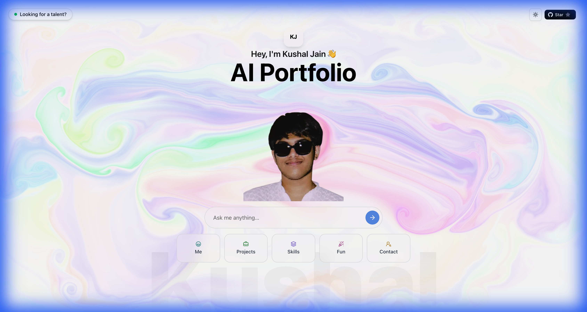

# 🚀 Kushal Jain's AI-Native Portfolio

<div align="center">
  
  
  
  [](https://kushu.me)
  [](https://nextjs.org/)
  [](https://www.typescriptlang.org/)
  [](https://www.deepseek.com/)
  
</div>

## 👋 About

Welcome to my AI-powered portfolio! This is not just a static website – it's an interactive experience where you can chat with an AI version of me, powered by **DeepSeek AI**. Ask about my projects, skills, experience, or anything else!

**Live at:** [kushu.me](https://kushu.me)

---

## ✨ Features

- 🤖 **AI Chatbot** - Chat with my AI twin powered by DeepSeek
- 🎨 **Modern UI/UX** - Beautiful animations with Framer Motion
- 📱 **Fully Responsive** - Works perfectly on all devices
- ⚡ **Lightning Fast** - Built with Next.js 15 and optimized for performance
- 🎯 **Interactive Projects** - Explore my work with Apple-style carousels
- 📄 **Dynamic Resume** - View and download my latest resume
- 🌙 **Dark Mode** - Sleek dark theme throughout

---

## 🛠️ Tech Stack

### **Frontend**
- **Framework:** Next.js 15 (App Router)
- **Language:** TypeScript
- **Styling:** Tailwind CSS
- **Animations:** Framer Motion
- **UI Components:** Radix UI + shadcn/ui

### **AI & Backend**
- **AI Model:** DeepSeek Chat (via AI SDK)
- **API Routes:** Next.js API Routes
- **Streaming:** Vercel AI SDK for real-time responses

### **Deployment**
- **Hosting:** Vercel
- **Domain:** kushu.me (via Namecheap)
- **CI/CD:** Automatic deployments via GitHub

---

## 🚀 Getting Started

### Prerequisites

- Node.js 18+ and npm
- DeepSeek API key ([Get one here](https://platform.deepseek.com/))

### Installation

1. **Clone the repository**
   ```bash
   git clone https://github.com/Kuushhhall/kushal-ai-assistant-portfolio.git
   cd kushal-ai-assistant-portfolio
   ```

2. **Install dependencies**
   ```bash
   npm install
   ```

3. **Set up environment variables**
   
   Create a `.env.local` file in the root directory:
   ```env
   DEEPSEEK_API_KEY=your_deepseek_api_key_here
   ```

4. **Run the development server**
   ```bash
   npm run dev
   ```

5. **Open your browser**
   
   Navigate to [http://localhost:3000](http://localhost:3000)

---

## 📁 Project Structure

```
├── src/
│   ├── app/
│   │   ├── api/
│   │   │   ├── chat/          # AI chatbot API routes
│   │   │   │   ├── route.ts   # Main chat endpoint
│   │   │   │   ├── prompt.ts  # AI persona & system prompt
│   │   │   │   └── tools/     # AI tool definitions
│   │   │   └── github-stars/  # GitHub API integration
│   │   ├── layout.tsx         # Root layout with metadata
│   │   └── page.tsx           # Landing page
│   ├── components/
│   │   ├── chat/              # Chat interface components
│   │   ├── projects/          # Project showcase components
│   │   ├── ui/                # Reusable UI components
│   │   ├── presentation.tsx   # About me section
│   │   ├── skills.tsx         # Skills showcase
│   │   ├── resume.tsx         # Resume section
│   │   └── contact.tsx        # Contact information
│   └── lib/                   # Utility functions
├── public/                    # Static assets
└── package.json
```

---

## 🤖 AI Chatbot Features

The AI chatbot is trained on my personal information and can:

- ✅ Answer questions about my background and experience
- ✅ Discuss my technical skills and projects
- ✅ Provide information about my education and internships
- ✅ Share my contact details and availability
- ✅ Talk about my hobbies (dancing, cinematography, editing)
- ✅ Stream responses in real-time for a natural conversation

**Powered by:** DeepSeek AI with custom system prompts and tool calling

---

## 🎨 Key Components

### **Landing Page**
- Animated memoji with smooth transitions
- Eye-catching hero section
- GitHub star count integration

### **Chat Interface**
- Real-time streaming responses
- Tool-based interactions (projects, skills, resume, etc.)
- Smooth animations and transitions
- Mobile-optimized design

### **Projects Showcase**
- Apple-style card carousel
- Detailed project descriptions
- Tech stack highlights
- Live demo and GitHub links

### **Skills Section**
- Categorized skill sets
- Visual skill cards with icons
- Covers: ML/AI, Data Science, Backend, DevOps, Databases, Tools

---

## 🌐 Deployment

This portfolio is deployed on **Vercel** with automatic deployments from the `main` branch.

### Deploy Your Own

[](https://vercel.com/new/clone?repository-url=https://github.com/Kuushhhall/kushal-ai-assistant-portfolio)

**Don't forget to add your `DEEPSEEK_API_KEY` in Vercel environment variables!**

---

## 📊 Performance

- ⚡ **Lighthouse Score:** 95+ across all metrics
- 🚀 **First Contentful Paint:** < 1s
- 📦 **Optimized Bundle Size:** Code splitting & lazy loading
- 🎯 **SEO Optimized:** Meta tags, Open Graph, structured data

---

## 📝 Customization

Want to create your own AI portfolio? Here's how:

1. **Fork this repository**
2. **Update personal information:**
   - `src/app/api/chat/prompt.ts` - AI persona and background
   - `src/components/presentation.tsx` - About section
   - `src/components/projects/Data.tsx` - Your projects
   - `src/components/skills.tsx` - Your skills
   - `src/components/contact.tsx` - Your contact info
3. **Replace images:**
   - `public/profile_kushal.png` - Your profile photo
   - `public/landing_page_memoji.png` - Your avatar/memoji
   - `public/Resume_Kushal_Jain.pdf` - Your resume
4. **Update metadata:**
   - `src/app/layout.tsx` - SEO and Open Graph tags
5. **Deploy to Vercel!**

---

## 🤝 Connect With Me

- 🌐 **Portfolio:** [kushu.me](https://kushu.me)
- 💼 **LinkedIn:** [linkedin.com/in/kushal-jain-b5a9a4257](https://www.linkedin.com/in/kushal-jain-b5a9a4257/)
- 🐙 **GitHub:** [github.com/Kuushhhall](https://github.com/Kuushhhall)
- 📧 **Email:** kushaljain0412@gmail.com
- 📸 **Instagram:** [@kushu_0412](https://www.instagram.com/kushu_0412/)

---

## 📄 License

This project is open source and available under the [MIT License](LICENSE).

---

## 🙏 Acknowledgments

- **AI SDK:** [Vercel AI SDK](https://sdk.vercel.ai/)
- **DeepSeek:** [DeepSeek AI Platform](https://www.deepseek.com/)
- **UI Components:** [shadcn/ui](https://ui.shadcn.com/)
- **Animations:** [Framer Motion](https://www.framer.com/motion/)
- **Inspiration:** Modern portfolio designs and AI-powered interactions

---

<div align="center">
  
  **Made with ❤️ by Kushal Jain**
  
  ⭐ Star this repo if you found it helpful!
  
</div>
